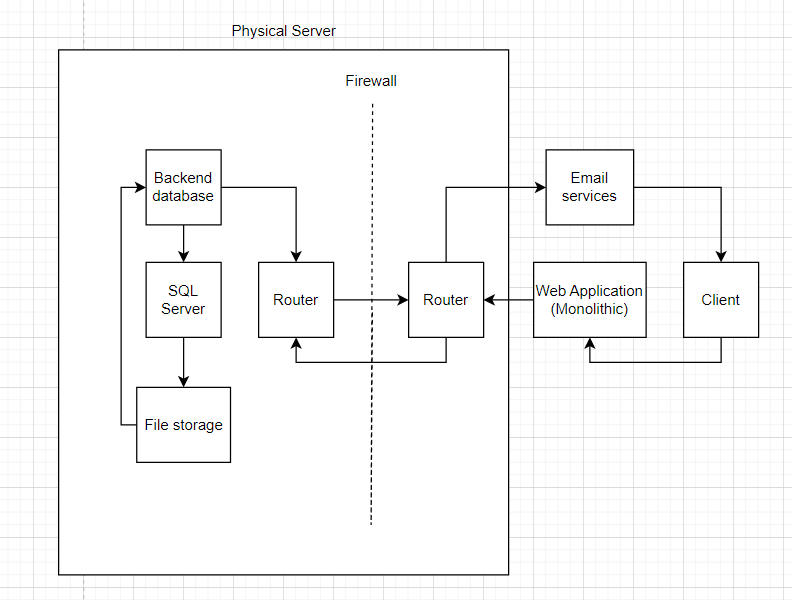

# Section 1

# Components in the Diagram

- **Physical Server**: Since the infrastructure is on-premise, there will be physical servers. This includes all devices, databases, as well as the SQL server and file storage on their mainframe.

- **Backend Database**: Handles the backend logic of the application, ensuring the application’s data processing and business logic work as expected.

- **SQL Server**: This is the chosen database system (e.g., PostgreSQL, MySQL, SQL Server). It manages all SQL-related tasks, such as queries, updates, and database administration.

- **File Storage**: Responsible for storing files and making them accessible to the server upon request.

- **Router**: Manages networking, routing data traffic securely through the firewall to ensure proper communication between components and external connections.

- **Firewall**: Restricts access to the database and backend systems, allowing only authorized connections through after passing security checks.

- **Email Services**: Manages email notifications to clients. This system interacts with the application to send alerts, updates, and notifications.

- **Web Application**: The frontend of the application, which the client interacts with. It processes requests from the client and sends back responses.

- **Client**: The end user of the system, interacting via a browser or other request-sending tools (e.g., API clients or mobile apps).

# Section 2:

# Migration Plan for Mid-Sized Retail Company

## Overview
This plan outlines the migration of on-premises infrastructure to the cloud, using PaaS, IaaS, and SaaS. A hybrid approach will be used for smooth transition and minimal disruption.

## 1. Components & Migration Strategy

### Web Application: PaaS
- **Current:** Hosted on physical servers.
- **Migration:** Use Azure App Service.

### Backend Database: PaaS
- **Current:** Local database handling business logic.
- **Migration:** Use Azure SQL Database for managed service.

### SQL Server: PaaS
- **Current:** On-premises SQL Server.
- **Migration:** Migrate to Azure SQL Database for simplified management.

### File Storage: PaaS
- **Current:** Local file storage.
- **Migration:** Move to Azure Blob Storage for scalable and secure cloud storage.

### Networking: PaaS
- **Current:** Managed by routers and firewalls.
- **Migration:** Use Azure Virtual Network.

### Email Services: SaaS
- **Current:** On-premises email server.
- **Migration:** Use Microsoft 365 for managed email services.

## 2. Migration Approach

1. **Phase 1: Lift and Shift**
   - Migrate the web app and database to Azure.
   - Set up cloud networking and file storage.

2. **Phase 2: Refactor for PaaS**
   - Move web app and database to PaaS.
   - Integrate SaaS email services.

3. **Phase 3: Optimize**
   - Complete migration, decommission on-premise systems, and optimize cloud infrastructure.
